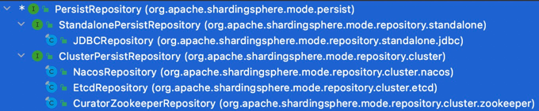

`TODO fan 标记`

# ContextManager
通过ContextManagerBuilder按照ContextManagerBuilderParameter进行构建。

而选用哪种ContextManagerBuilder，由ModeConfiguration决定（有cluster模式和standalone模式）：
- StandaloneContextManagerBuilder（default）
- ClusterContextManagerBuilder

builder中会构建对应的PersistRepository：
- StandalonePersistRepository
    - JDBCRepository
- ClusterPersistRepository
    - CuratorZookeeperRepository
    - EtcdRepository
    - NacosRepository
    

之后基于PersistRepository构建MetaDataPersistService。

对于持久化：
- 本地配置存在 且 overwrite = true，那么会将本地配置持久化到远端（如standalone模式的h2 jdbc，cluster模式的zk/etcd/nacos）
- 本地配置存在，如果 overwrite = false，但是远端不存在该数据源的配置，那么也会持久化到远端
- 如果本地配置不存在的话，那么就不会持久化远端了，**就会从远端加载配置信息**

sharding-sphere用了大量的yaml进行序列化实现。内部全部使用yaml格式进行处理。

ProcessStandaloneSubscriber

## check state
会对每个data source进行连接探测。

