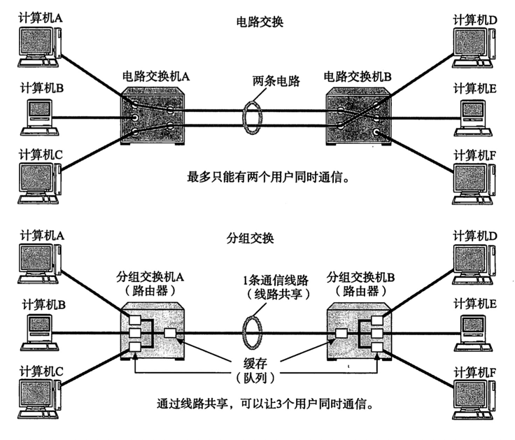

# OSI模型
以发送电子邮件为例说明

| 分层名称 | 说明  |
| --- | --- |
| 应用层 | 将邮件的文字信息编辑好后，点击发送后，增加收件人地址发送到网络 |
|表示层| 网络上不仅仅有计算机的邮件软件，还有手机等设备的邮件软件，其编码方式可能不同，按照不同的编码方式编解码 |
|会话层|表示何时建立连接、关闭连接。但是不负责具体的连接建立与释放|
|传输层|真正的建立连接、关闭连接，涉及的设备是主机|
|网络层|在网络上进行路由，涉及的设备是路由器|
|数据链路层|涉及的设备是交换机|
|物理层|涉及的设备是网卡、网线|

# 电路交换与分组交换
电路交换是指一根通信线路上只能有一对设备在通信。常见的是打电话的场景。
如果有多个人在一根电话线上同时说话，就乱套了。

分组交换是指一个通信线路上可以有多对设备在通信。这样通信设备的双方需要将
内容分组，到达对端后再组装起来。

# 面向连接与面向无连接

面向连接，常见场景是打电话的场景。只有通过电话号码，对方接了电话才能
说话，对话完了，挂掉电话，关闭连接。如果拨打电话时，对方没有接电话，那么
通信失败。

面向无连接，比较好理解的场景是发送快递。在发送快递的时候，邮局并不关心对方在不在，也不关心地址
地址对不对，直接发送。

